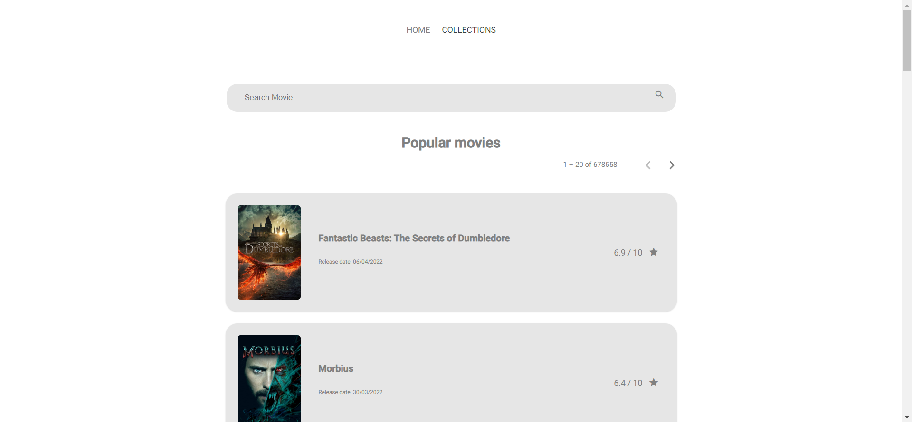

# The Movies Application

This project was generated with [Angular CLI](https://github.com/angular/angular-cli) version 10.0.1.

## Live Demo

Live demo of the application deployed on [Vercel](https://www.netlify.com/)

Link: [https://the-movies-application.vercel.app/](https://the-movies-application.vercel.app/)

## Run on Docker Compose

Run `docker-compose -up --build`   
Navigate to `http://localhost:4200/`. 

## Development server

Run `cd popular-movie`  
Run `npm install`  
Run `ng serve` for a dev server.  
Navigate to `http://localhost:4200/`. 

The app will automatically reload if you change any of the source files.

## Local Build

Run `cd popular-movie`  
Run `ng build` to build the project.  
The build artifacts will be stored in the `dist/` directory. Use the `--prod` flag for a production build.

You can serve the web app by running a Lightweight development node server. 
Run inside `dist/popular-movie/` directory: `npx light-server -s . --historyindex '/index.html' -o`   
Navigate to `http://localhost:4000/`. 

## Examples

1.

2.

3.

